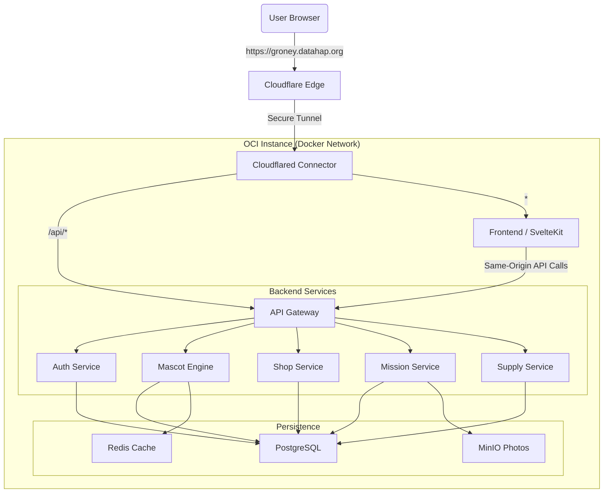

# Groney System Design & Architecture

This document describes the production architecture, service configuration, and networking setup for the **Groney** platform.

---

## 1. High-Level Architecture

Groney is a microservices-based application designed for scalability and maintainability. It follows a **Single-Domain Strategy** to optimize performance and security.

### 🌐 Overall Flow

1.  **Client** hits `https://groney.datahap.org`.
2.  **Cloudflare Tunnel (Cloudflared)** intercepts the request.
3.  **Routing Logic** (Path-based):
    *   `/api/*` → Forwards to **API Gateway** container.
    *   `*` (All other) → Forwards to **Frontend (SvelteKit)** container.
4.  **API Gateway** acts as the internal traffic controller, delegating requests to specialized microservices.

---

## 2. Cloudflare Tunnel Configuration

We use a single domain (`groney.datahap.org`) with a path-based routing strategy in **Cloudflare Tunnels (Zero Trust)**.

### Published Application Routes
| Path | Service URL | Purpose |
| :--- | :--- | :--- |
| `api` | `http://groney-api-gateway:3000` | Backend API traffic (Same-Origin) |
| `*` | `http://groney-frontend:5173` | UI, Static Assets, SSR |

### Benefits of this setup:
- **CORS-Free**: Since the API and Frontend share the same domain, browser "Preflight" (OPTIONS) requests are eliminated, improving performance by up to 50% for mobile users.
- **Single Entry Point**: All public traffic passes through a unified tunnel, simplifying SSL management and security rules.
- **Zero Exposed Ports**: No ports are open to the public internet on the Oracle Cloud instance. All traffic is tunneled securely.

---

## 3. Service Descriptions

The backend is decomposed into specialized services, all sharing a single PostgreSQL database via **Prisma**.

### 🏗️ Core Infrastructure
- **PostgreSQL**: Primary data persistence.
- **Redis**: Caching and session management.
- **MinIO**: S3-compatible object storage for mission proof photos.

### 🔌 Microservices
| Service | Internal Port | Responsibility |
| :--- | :--- | :--- |
| **API Gateway** | `3000` | Consolidated entry point, rate limiting, and request forwarding. |
| **Auth Service** | `3001` | User registration, Teacher/Student login, and Role-Based Access Control (RBAC). |
| **Mascot Engine** | `3002` | Tamagotchi logic: stat decay calculations, leveling up, and health state management. |
| **Mission Service** | `3003` | CRUD for sectors and missions, activity feed management. |
| **Submission Service** | `3004` | Handling student mission proofs and teacher approval workflows. |
| **Shop Service** | `3005` | Seed (Coins) management, item purchases, and mascot customization. |
| **Calculation Service** | `3006` | CO2 reduction impact calculations based on real-world activities. |
| **Supply Service** | `3007` | Managing real-world green schoolyard tool requests and inventory. |

---

## 4. API Gateway Routing Matrix

The Gateway maps incoming public `/api` paths to internal service names using Docker DNS.

| Public Path | Internal Target |
| :--- | :--- |
| `/api/auth/*` | `http://auth-service:3001` |
| `/api/teacher/*` | `http://auth-service:3001` (Class Management) |
| `/api/student/*` | `http://auth-service:3001` (Class Join) |
| `/api/mascot/*` | `http://mascot-engine:3002` |
| `/api/shop/*` | `http://shop-service:3005` |
| `/api/supply/*` | `http://supply-service:3007` |
| `/api/health` | Gateway Internal |

---

## 5. Deployment Information

- **Host**: Oracle Cloud Infrastructure (OCI).
- **Orchestration**: Docker Compose.
- **Environment Management**: OCI Vault (Secrets) → injected directly into environment variables (in-memory) via `launch-on-oracle.sh`, preventing secret leakage to the filesystem. The secret structure follows `.env.secrect-vault.example`.
- **Database Migrations**: Managed via Prisma CLI inside the `auth-service` container.

---

## 6. Key Configuration Variables

- `VITE_API_URL`: Should be set to `https://groney.datahap.org` (leveraging the `/api` routing).
- `NODE_ENV`: Set to `production` in the OCI Vault.
- `POSTGRES_PASSWORD`: The secure password for the database (Note: `DATABASE_URL` is constructed internally or optional).